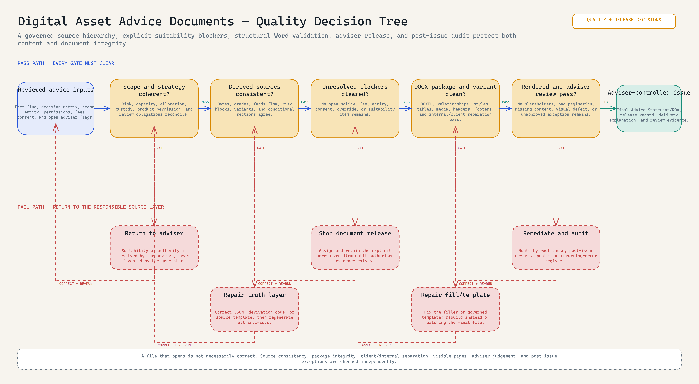

# Digital Asset Advice Document Production System

**Status:** implemented through multiple controlled releases.

> **Note:** Project materials are redacted for presentation purposes. Client details, advice content, credentials, commercial templates, and internal terminology are excluded or replaced; the document mechanics, workflow controls, and validation evidence are retained.

This was a versioned digital-asset advice-document production system, rather than a document-mail-merge exercise. It turned a reviewed client fact-find and decision matrix into a content-review pack, a merged-input audit record, and client-ready Advice Statement and Record of Advice (ROA) Word files while preserving the governed template's layout and controls. It handled calculated fields, conditional sections, markdown tables, terminology cleanup, placeholder removal, template XML health, branded document assembly, and batch QA.

*The visual makes the adviser-controlled intake and delivery boundary explicit, from reviewed sources through document production and release. Read the [workflow evidence specification](evidence/workflow-specification.md), open the full-size [PNG](evidence/diagrams/advice-document-production-v2.png), or edit the [Excalidraw source](evidence/diagrams/advice-document-production-v2.excalidraw).* 

## How quality is actually controlled

The system does not treat generation as completion. Scope and suitability can return to the adviser; derived sources can return to JSON, code, or the source template; unresolved authority blocks release; and DOCX structure, client/internal separation, rendered pages, adviser review, and post-issue exceptions are checked independently.

[Full-size PNG](evidence/diagrams/advice-quality-decision-tree.png) · [Editable Excalidraw](evidence/diagrams/advice-quality-decision-tree.excalidraw) · [Gate-by-gate quality specification](evidence/quality-control-specification.md)

## What I designed and implemented

- structured JSON intake with derived dates, amounts, grades, and allocation checks;
- reusable narrative blocks for recommendations, assumptions, permissions, and risks;
- conditional section removal when a topic did not apply;
- template-aware DOCX filling without flattening tables, headers, footers, images, or named styles;
- batch manifests and checks for unresolved placeholders, internal reference codes, and missing outputs;
- separate source, generated Markdown, and final Word validation stages.

## End-to-end operating model

The production sequence was deliberately split between advice work that requires an adviser and deterministic document mechanics that can be checked repeatably:

1. The client completes the DARS/DARP process; the adviser scopes the engagement and completes client and adviser fact-find work.
2. Operations transcribes reviewed intake into a client workspace with `fact_find.json`, `decision_matrix.json`, and a file of open adviser flags. The source JSON remains the lowest editable truth layer.
3. Stage 1 derives grade bands, allocation and permission fields, funds-flow text, costs, assumptions, risk blocks, and conditional sections. It produces an Advice Statement Markdown source, ROA Markdown source, and merged-input JSON snapshot.
4. Content review happens against the Markdown and audit snapshot. An unresolved policy, fee, legal-entity, consent, or suitability question remains an explicit blocker; it is never invented by the generator.
5. Stage 2 fills the preserved Word templates directly. This is materially different from converting Markdown into a new DOCX: the direct-fill path retains cover geometry, headers, footers, branded callouts, styles, tables, images, and Word relationships.
6. Structural QA checks the DOCX package and visible text; the release pass also confirms the correct clean/internal variant and reviews rendered pages. A repeat defect is fixed at the JSON, derivation, source-template, or DOCX-template layer that caused it, then regenerated.
7. The adviser explains the document, obtains the required decision before implementation, and records the post-advice review. The system does not make or approve financial advice.

See the detailed [client-delivery operating model](instructions/end-to-end-client-delivery.md) and the [pipeline and release controls](instructions/pipeline-and-release-controls.md).

## Recorded implementation evidence

| Release evidence | Result |
|---|---|
| Active v8 generation path | Implemented |
| Staged v9 batch | 12 presentation-equivalent work items, 24 DOCX outputs, QA passed |
| v11 template-preservation checks | Styles, tables, headers, footers, and images preserved |
| Placeholder gate | Cleared in the recorded v11 output |

The batch counts are retained implementation results. No client advice documents are published.

## Inspect the proof

| Artifact | Purpose |
|---|---|
| [`template_engine.py`](src/template_engine.py) | Flattening, placeholder, and conditional-section mechanics |
| [`document_qa.py`](src/document_qa.py) | Safe DOCX package and visible-text checks |
| [`presentation-record.json`](samples/presentation-record.json) | Redacted presentation input contract |
| [`presentation-output.md`](samples/presentation-output.md) | Presentation example of generated narrative |
| [`test_document_qa.py`](tests/test_document_qa.py) | Tests for placeholder and internal-code gates |
| [`test-receipt.md`](tests/test-receipt.md) | Recorded result summary and reproducible test command |
| [`pipeline-and-release-controls.md`](instructions/pipeline-and-release-controls.md) | Actual two-stage architecture, version states, and release gates |
| [`end-to-end-client-delivery.md`](instructions/end-to-end-client-delivery.md) | Intake, source-of-truth hierarchy, version progression, delivery, and review model |
| [`source-map.md`](evidence/source-map.md) | Reviewed lineage and exclusions |

## Boundary

This is a document-production and quality-control system, not an autonomous advice engine. The presentation material is not financial advice.
## Copy and adapt

**Start here:** Review the [pipeline controls](instructions/pipeline-and-release-controls.md), [presentation record](samples/presentation-record.json), [template engine](src/template_engine.py), [QA source](src/document_qa.py), and [tests](tests/).
