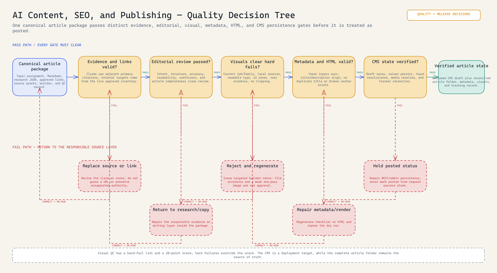

# AI Content, SEO, and Publishing System

<!-- portfolio-diagram:start -->


*The article folder remains canonical while evidence, links, visuals, metadata, and CMS state pass separate gates. [Open the full-size PNG](evidence/diagrams/ai-content-and-seo-system-workflow-diagram.png), [editable Excalidraw source](evidence/diagrams/ai-content-and-seo-system-workflow-diagram.excalidraw), or [evidence-backed specification](evidence/workflow-specification.md).*

<!-- portfolio-diagram:end -->

## How quality is actually controlled

Evidence, copy, links, visuals, metadata, rendered HTML, and CMS persistence do not share one vague “review” box. Each has its own stop condition and correction owner. Visuals have hard failures plus a scored review and must be regenerated after rejection. WordPress receives a draft, then saved values, media, Yoast recalculation, and the tracking record are reconciled before the package is treated as posted.



[Full-size PNG](evidence/diagrams/content-publishing-quality-decision-tree.png) · [Editable Excalidraw](evidence/diagrams/content-publishing-quality-decision-tree.excalidraw) · [Gate-by-gate quality specification](evidence/quality-control-specification.md)

> **Note:** Project materials are redacted for presentation purposes. Live credentials, analytics, cookies, site inventory, and published article content are excluded; the article operating system, workflow controls, and executable tooling are retained.

This package shows the working layer behind a WordPress education site: topic-cluster planning, article packages, source-safe visual production, internal-link governance, metadata synchronization, readability gates, and draft publishing handoff. The article folder—not the WordPress editor—is the source of truth.

## What I designed and implemented

- a canonical article-folder contract containing copy, research, metadata, sources, and visual instructions;
- topic-cluster and approved internal-link inputs that constrain article planning;
- executable article scaffolding and source-safe local visual generation;
- claim-level research, readability, metadata, internal-link, and visual checks;
- Yoast frontmatter synchronization and a controlled WordPress draft handoff;
- separate correction routes so a failed gate returns to the responsible content, evidence, link, visual, or CMS layer.

## Package lifecycle

1. Select a topic from the cluster and keyword plans.
2. Scaffold `articles/draft/<slug>/` with Markdown, research JSON, source-asset lanes, and an article-specific visual builder.
3. Research with claim-level citations and approved internal-link targets.
4. Draft and run readability, metadata, link, and visual gates.
5. Generate local visuals from reviewed assets; never fetch arbitrary media during render.
6. Publish as a draft, verify in the CMS, then move the complete package to `articles/posted/<slug>/`.

## Inspect the implementation

- [Article scaffolder](src/create_article_v2.py)
- [Visual helper library](src/article_visual_starter_lib.py)
- [Visual runner](src/generate_article_visuals.py)
- [Yoast frontmatter synchronizer](src/sync_yoast_frontmatter.py)
- [Article operating guide](instructions/article-operations.md)
- [Editorial gates](instructions/editorial-gates.md)
- [Source map](evidence/source-map.md)

## Copy and adapt

Copy `src/` into a repository where the scripts sit under `posts/scripts/`, or update their path constants. Replace the visual brand fixture and category taxonomy before scaffolding.

```powershell
python src/create_article_v2.py "Example Article Title"
python src/sync_yoast_frontmatter.py --help
```

The included code is an operating extract, not a claim of ranking gains. It demonstrates the controls used to prepare and audit content.
