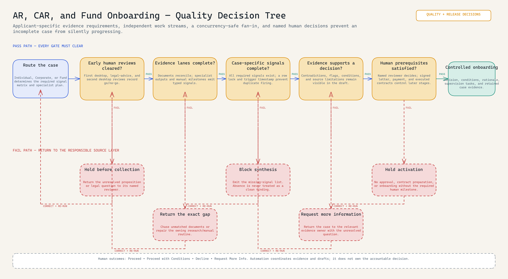

# AR, CAR, and Fund Onboarding System

<!-- portfolio-diagram:start -->


*The revised visual shows the complete lifecycle while keeping human-owned gates, mixed deployment state, and the evidence fan-in boundary visible. [Open the full-size PNG](evidence/diagrams/assessment-automation-workflow-diagram.png), [editable Excalidraw source](evidence/diagrams/assessment-automation-workflow-diagram.excalidraw), or [evidence-backed specification](evidence/workflow-specification.md).*

<!-- portfolio-diagram:end -->

> **Note:** Project materials are redacted for presentation purposes. Identifying details, credentials, live case data, and confidential documents are excluded or replaced; the architecture, workflow logic, controls, and implementation evidence are retained. At the recorded project cut-off, some built workflows had not been activated and the asynchronous report path had not completed end-to-end validation.

The system is a full AR, Corporate AR (CAR), and fund onboarding operating model, with an n8n/MCP control plane around the evidence-gated part of the lifecycle. Staff or agents start bounded actions through MCP, specialist research runs are logged, completions become typed signals, and a fan-in gate refuses synthesis until the required evidence set exists. Final approval remains human.

## How quality is actually controlled

The overview shows the lifecycle; this decision tree shows the rejection logic. Applicant type changes the evidence contract. Three early human reviews can stop the case before collection. Documents, specialist research, and manual milestones can fail independently. The final fan-in is both case-specific and concurrency-safe, and later engagement, contract, and onboarding stages remain blocked until their own human prerequisites exist.



[Full-size PNG](evidence/diagrams/assessment-quality-decision-tree.png) · [Editable Excalidraw](evidence/diagrams/assessment-quality-decision-tree.excalidraw) · [Gate-by-gate quality specification](evidence/quality-control-specification.md)

## What I designed and implemented

- the end-to-end lifecycle model covering inquiry, early human review, collection, due diligence, engagement, contracts, onboarding, and supervision;
- applicant-specific routing for Individual AR, Corporate AR, and fund pathways;
- MCP-facing actions and n8n orchestration around document checks and specialist research;
- a typed evidence-signal contract that lets automated and manual work enter the same auditable case state;
- fan-out execution and fan-in completeness controls that prevent premature synthesis;
- asynchronous report submission, execution, and status tracking for long-running work;
- explicit human decision ownership and correction paths for incomplete cases.

## Architecture

```text
staff/agent MCP tool
  -> document collection or research launcher
  -> specialist work outside the gate
  -> completion receiver
  -> typed evidence signal
  -> case gate
  -> draft synthesis
  -> human decision
```

Manual milestones use the same signal contract, so work performed outside automation is still auditable. A separate submit/runner/status trio handles long-running report generation without holding an HTTP request open.

## Full lifecycle represented

The public exports concentrate on the highest-risk coordination layer, but the source system covered the lifecycle below. It separates mechanical orchestration, human judgement, structured analysis, and independent research rather than pretending the entire case can be automated.

| Stage | Working mechanism | Outcome | Source state |
|---|---|---|---|
| Inquiry | Intake and routing by Individual, Corporate, or Fund pathway | Case record, folder, staff notification | Built; lifecycle export omitted from the public bundle |
| Early review | First desktop review, legal-advice assessment, second desktop review | Human go/no-go before collection | Intentionally manual |
| Document collection | Staff-triggered checklist plus one batch reconciliation of uploaded files | Checklist state, unmatched-file log, `documents_ready` signal | Built control pattern |
| Evidence development | Meeting analysis, reference analysis, KYC evidence, and applicant-specific research agents | Structured evidence records and typed completion signals | Mixed: manual and workflow-supported |
| DD fan-in | Signal receiver and completion gate | Missing evidence returns to its owning route; absence is not a clean finding | Public workflow exports and runnable local gate |
| DD synthesis and decision | Structured DD report and senior review | Proceed, Proceed with Conditions, Decline, or Request More Info | Human decision; async path was untested |
| Engagement | Draft engagement letter and manual signing/invoice milestones | `letter_signed` and `payment_received` | Draft/manual handoff |
| Contract preparation | Tasks, legal/staff ownership, executed-contract milestone | `contracts_executed` | Built but inactive in source snapshot |
| Onboarding and activation | AR/CAR/fund-specific onboarding tasks and supervision setup | Activated operation and archived record | Built but inactive in source snapshot |

The detailed [AR/CAR/fund lifecycle](instructions/ar-car-fund-lifecycle.md) includes the routing matrix, signal contract, routine responsibilities, and honest deployment state.

## Inspect the implementation

- [`mcp-control-plane.workflow.json`](workflows/mcp-control-plane.workflow.json): narrow tool registry; public forms, schedules, and internal gates stay outside MCP.
- [`document-checklist.workflow.json`](workflows/document-checklist.workflow.json) and [`document-batch-check.workflow.json`](workflows/document-batch-check.workflow.json): checklist launch and consolidated document processing.
- [`research-agent-launcher.workflow.json`](workflows/research-agent-launcher.workflow.json): applicant-type routing and per-agent job records.
- [`research-agent-completion.workflow.json`](workflows/research-agent-completion.workflow.json): output upsert, RA-code-to-signal mapping, and gate forwarding.
- [`manual-signal-receiver.workflow.json`](workflows/manual-signal-receiver.workflow.json): human-entered milestones through form or internal tool trigger.
- [`signal-completion.workflow.json`](workflows/signal-completion.workflow.json) and [`evidence-gate.workflow.json`](workflows/evidence-gate.workflow.json): fan-in and synthesis gate.
- [`async-report-submit.workflow.json`](workflows/async-report-submit.workflow.json), [`async-report-runner.workflow.json`](workflows/async-report-runner.workflow.json), and [`async-report-status.workflow.json`](workflows/async-report-status.workflow.json): 202-style submit, internal runner, and polling status surface.
- [`stage_gate.py`](src/stage_gate.py): small runnable public state-machine extract.
- [`source-map.md`](evidence/source-map.md): source truth, status, transformations, and exclusions.
- [`ar-car-fund-lifecycle.md`](instructions/ar-car-fund-lifecycle.md): the complete operating model outside the narrow public control-plane exports.

## Copy and adapt

Replace the case schema, applicant types, evidence requirements, specialist routing table, signal vocabulary, database queries, storage paths, credentials, and notification adapter. Keep these controls:

- missing evidence blocks synthesis;
- subject claims and independent verification stay distinct;
- every specialist completion is recorded before it emits a signal;
- internal gates are not exposed as broad MCP tools;
- long-running synthesis uses submit/poll rather than a fragile synchronous call;
- approval and decline require a named human reviewer.

Run `python -m unittest discover -s workflows/assessment-automation/tests -v` and parse every workflow JSON before importing.
