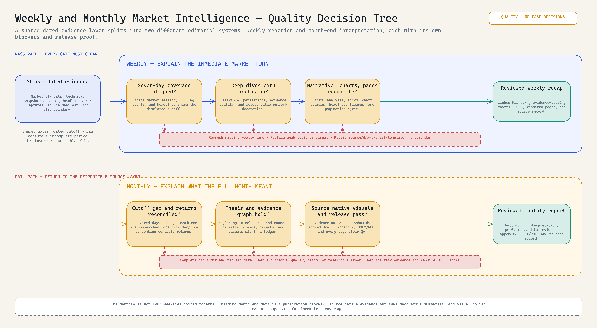
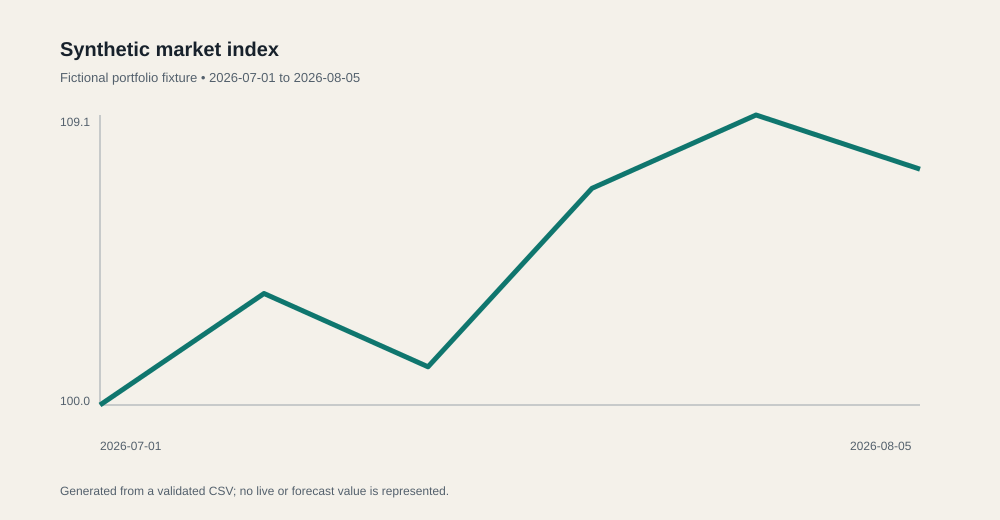

# Weekly and Monthly Crypto Market Intelligence

<!-- portfolio-diagram:start -->


*The revised visual makes the shared evidence layer and different weekly/monthly report jobs explicit. [Open the full-size PNG](evidence/diagrams/market-report-automation-workflow-diagram.png), [editable Excalidraw source](evidence/diagrams/market-report-automation-workflow-diagram.excalidraw), or [evidence-backed specification](evidence/workflow-specification.md).*

<!-- portfolio-diagram:end -->

## How quality is actually controlled

Both products start from a dated evidence contract, but they split after collection. The weekly route checks seven-day coverage, chooses only defensible deep dives, and reconciles narrative, links, charts, source lines, and rendered pages. The monthly route audits every day after the last weekly cutoff, rebuilds returns to one month-end boundary, constructs a causal narrative graph and evidence ledger, prefers source-native exhibits, scores the draft for publication blockers, and rechecks the complete DOCX/PDF page set.



[Full-size PNG](evidence/diagrams/market-intelligence-quality-decision-tree.png) · [Editable Excalidraw](evidence/diagrams/market-intelligence-quality-decision-tree.excalidraw) · [Gate-by-gate quality specification](evidence/quality-control-specification.md)

**Status:** implemented as a source-to-chart-to-DOCX workflow.

> **Note:** Project materials are redacted for presentation purposes. Paid-source outputs, internal commentary, credentials, commercial templates, and completed reports are excluded or replaced; the collection model, report flow, chart controls, and validation evidence are retained.

The reporting workspace is a recurring weekly and monthly market-intelligence production system. It collects market observations, token unlocks, ETF-flow data, technical-analysis snapshots, editorial source material, and evidence-bearing visuals; then produces branded charts and reviewed Word reports from controlled templates. The repository includes an inspectable slice in which validated presentation data becomes a deterministic SVG chart and source manifest, while the [weekly and monthly operating model](instructions/weekly-and-monthly-production.md) documents the complete delivered workflow.

## What I designed and implemented

- recurring collection lanes for market data, ETF flows, token unlocks, technical snapshots, and narrative research;
- dated evidence workspaces with explicit weekly and month-end cut-offs;
- chart generators, chart manifests, and evidence-bearing source visuals;
- distinct weekly-recap and monthly-state-of-market editorial structures;
- branded Word-template assembly, package validation, and full rendered-page review;
- retained source and visual indexes so a published claim or exhibit can be traced and refreshed.



## System components

- collectors for market analysis, token unlocks, and ETF flows;
- chart generators for prices, flows, and comparison views;
- report assembly into a Word template;
- weekly and monthly source manifests;
- recreation guides and archived issue structure.

## What the recurring reporting system actually does

| Cadence | Editorial job | Core inputs | Production output |
|---|---|---|---|
| Weekly recap | Explain the week's market turn and the immediate catalysts | Seven-day headline capture, token unlocks, BTC/ETH market and technical snapshots, ETF flows, current deep-dive evidence | Linked Markdown draft, BTC/ETH and ETF charts, two claim-relevant source visuals, reviewed DOCX |
| Monthly state-of-market | Explain what the full month meant, rather than concatenate weeklies | Month-end reconciled data, performance table, weekly archive, research-agent additions, narrative map, evidence ledger, source-native visuals | 8-12 page report with market structure, macro, regulation, watchboard, methodology, and visual-evidence index |

Both cadences require source cut-off reconciliation, retained raw inputs, editorial selection, report-specific visual planning, DOCX package validation, and a full rendered-page inspection. They do not publish merely because a collector ran or a document opened.

## Inspect the proof

| Artifact | Purpose |
|---|---|
| [`generate_market_chart.py`](src/generate_market_chart.py) | Runnable, dependency-free chart renderer |
| [`fetch_market_analysis.py`](src/fetch_market_analysis.py) | Original public-market collector with raw candles, indicators, and incomplete-period disclosure |
| [`presentation-market-series.csv`](samples/presentation-market-series.csv) | Redacted presentation time series |
| [`market-sample.svg`](samples/market-sample.svg) | Generated chart |
| [`source-manifest.json`](samples/source-manifest.json) | Source-date and fixture disclosure |
| [`test_generate_market_chart.py`](tests/test_generate_market_chart.py) | Validation and rendering tests |
| [`weekly-runbook.md`](instructions/weekly-runbook.md) | Actual collection, drafting, chart, DOCX, and release sequence |
| [`weekly-and-monthly-production.md`](instructions/weekly-and-monthly-production.md) | Full weekly and monthly production model, artefacts, QA, and differences between the two report types |
| [`source-map.md`](evidence/source-map.md) | Reviewed implementations and exclusions |

## Run

```powershell
python src/generate_market_chart.py samples/presentation-market-series.csv samples/market-sample.svg
python -m unittest discover -s tests -v
```

## Boundary

The presentation chart is not current market data and cannot support an investment conclusion.
## Copy and adapt

**Start here:** Run the [chart generator](src/generate_market_chart.py) against the [presentation CSV](samples/presentation-market-series.csv), or inspect the [market collector](src/fetch_market_analysis.py). Retain raw responses and the [source manifest](samples/source-manifest.json).
