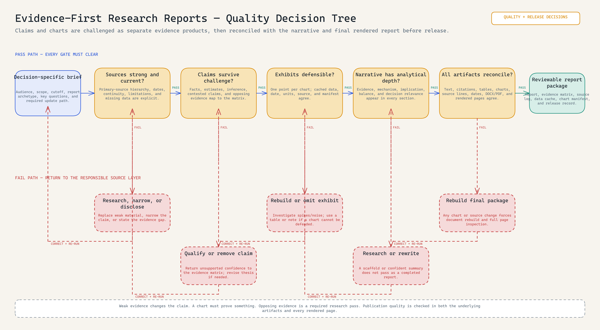

# Evidence-First Digital Asset Research Report Production

<!-- portfolio-diagram:start -->


*The revised visual connects the runnable evidence controls to the complete long-form report, chart, DOCX/PDF, and refresh workflow. [Open the full-size PNG](evidence/diagrams/research-report-builder-workflow-diagram.png), [editable Excalidraw source](evidence/diagrams/research-report-builder-workflow-diagram.excalidraw), or [evidence-backed specification](evidence/workflow-specification.md).*

<!-- portfolio-diagram:end -->

## How quality is actually controlled

The report has two evidence products that can fail separately: the claim set and the exhibit set. Weak sources force a narrower claim or an explicit gap. Opposing evidence can change the thesis. A visible spike or trough must reconcile to cached data. Charts must prove one point and survive visual inspection. Only then do text, citations, tables, charts, dates, DOCX/PDF structure, and rendered pages reconverge for release.



[Full-size PNG](evidence/diagrams/research-quality-decision-tree.png) · [Editable Excalidraw](evidence/diagrams/research-quality-decision-tree.excalidraw) · [Gate-by-gate quality specification](evidence/quality-control-specification.md)

**Status:** runnable staged workspace built from the original script chain.

> **Note:** Project materials are redacted for presentation purposes. Proprietary research, paid-source content, internal data, and completed report text are excluded or replaced; the production method, source controls, chart workflow, and runnable staging tools are retained.

This system creates a clean research workspace before drafting begins. It fixes the topic, audience, report archetype, source log, and evidence matrix; then it generates an outline appropriate to the selected decision format. The original production workspace also used this evidence-first pattern to rebuild long-form, investor-facing digital-asset reports: source capture and context first, cached market data and chart manifests next, then document assembly, PDF export, and visual QA.

## What I designed and implemented

- decision-specific briefs and report archetypes that establish purpose before research begins;
- source logs, evidence matrices, and context packs that keep claims tied to support;
- staged workspaces and reproducible cached-data inputs;
- chart planning and manifests that connect every exhibit to its data and report purpose;
- an evidence-led drafting and document-assembly sequence for long-form digital-asset reports;
- DOCX/PDF rendering, visual inspection, source manifests, and a repeatable update path.

## Full research-report production flow

The portfolio scripts are intentionally small and runnable. The [full long-form report model](instructions/long-form-research-report-production.md) shows how that control layer extended into actual annual-report production:

```text
Decision brief
  -> source and context pack
  -> claim/evidence matrix + report outline
  -> cached market and protocol data
  -> chart plan, manifest, and branded chart set
  -> evidence-led long-form draft
  -> DOCX assembly and PDF/render review
  -> final report, source manifest, and reproducible update path
```

It supported asset-specific report builds from a shared visual and document standard rather than treating each report as a one-off Word file.

## Inspect the proof

| Artifact | Purpose |
|---|---|
| [`stage_research_workspace.py`](src/stage_research_workspace.py) | Stages scripts and a clean workspace |
| [`create_research_brief.py`](src/create_research_brief.py) | Captures topic, audience, scope, and format |
| [`create_source_log.py`](src/create_source_log.py) | Creates a source-tracking CSV |
| [`create_evidence_matrix.py`](src/create_evidence_matrix.py) | Creates a claim-to-evidence matrix |
| [`outline_to_report_skeleton.py`](src/outline_to_report_skeleton.py) | Supports nine report archetypes |
| [`demo-workspace`](samples/demo-workspace/) | Generated presentation research workspace |
| [`evidence-first-workflow.md`](instructions/evidence-first-workflow.md) | Operating sequence and boundary between controls and research |
| [`long-form-research-report-production.md`](instructions/long-form-research-report-production.md) | End-to-end report production model: source packs, chart manifests, document generation, and release QA |
| [`source-map.md`](evidence/source-map.md) | Source lineage and exclusions |

The presentation staging script has one path adaptation: it copies from this repository's `src/` folder. The other included scripts preserve their project behaviour.

## Run

```powershell
python src/stage_research_workspace.py samples/new-workspace --topic "Example topic" --audience "operations leader" --archetype "briefing-note"
python src/outline_to_report_skeleton.py briefing-note samples/new-workspace/output/report.md --title "Example Brief"
```

## Why this is useful

The report skeleton is downstream of evidence planning, not a substitute for it. Source logs and evidence matrices make unsupported statements easier to detect before design work begins.

## Boundary

The demo workspace contains no external research claims. It demonstrates staging and document structure only; a real report requires current sources, citations, editorial review, and source-specific publication rights.
## Copy and adapt

**Start here:** Inspect the [script chain](src/), [operating sequence](instructions/evidence-first-workflow.md), generated [demo workspace](samples/demo-workspace/), run command, and reusable [research-report-builder skill](../../skills/research-report-builder/).
